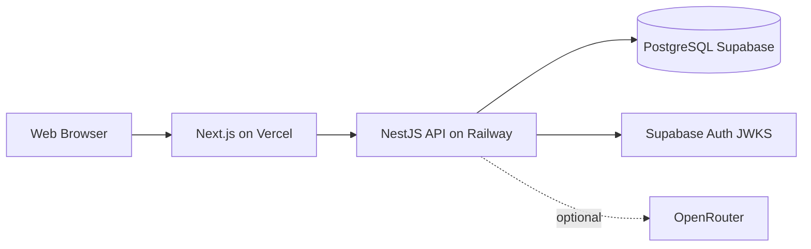

# Requirement Analysis Document (RAD) / Software Requirements Specification

**Bahir Dar University · Bahir Dar Institute of Technology · Faculty of Computing**

**Industrial project:** AI-Powered Business Operations Optimization SaaS Platform for Small and Medium Enterprises  
**Program:** BSc Software Engineering · **Advisor:** Elshaday  
**Group:** Abel Sisay, Kabanesh Bewket, Maeza Endalew, Surafel Bishaw

> Single-file export. Render UML from `docs/RAD/diagrams/**/*.puml` and insert PNGs into Word.

---

# Front matter

> Copy this section into your final Word/PDF submission. Page numbers are placeholders until pagination is applied.

---

## Declaration

The Project is our own and has not been presented for a degree in any other university and all the sources of material used for the project have been duly acknowledged.

| Name | Signature |
|------|-----------|
| Abel Sisay | _________________ |
| Kabanesh Bewket | _________________ |
| Maeza Endalew | _________________ |
| Surafel Bishaw | _________________ |

**Faculty:** Computing  
**Program:** Software Engineering  
**Project Title:** AI-Powered Business Operations Optimization SaaS Platform for Small and Medium Enterprises

This is to certify that I have read this project and that in my supervision and the students' performance, it is fully adequate, in scope and quality, as a project for the degree of Bachelor of Science.

| Advisor | Signature |
|---------|-----------|
| Elshaday | _________________ |

**Examining committee**

| # | Examiner | Signature | Date |
|---|----------|-----------|------|
| 1 | ___________________ | __________ | ____ |
| 2 | ___________________ | __________ | ____ |

---

## Roles and responsibilities of the group members

| Task | Abel Sisay | Maeza Endalew | Kabanesh Bewket | Surafel Bishaw |
|------|:----------:|:-------------:|:---------------:|:--------------:|
| Requirement gathering | √ | | √ | |
| Requirement analysis | √ | √ | | |
| Feasibility study | | √ | | √ |
| Documentation | √ | √ | | |
| Architectural design | | | √ | √ |
| User interface prototype | √ | | | √ |
| Activity diagram | | √ | √ | |
| Sequence diagram | | | √ | √ |
| Use case diagram | √ | | | |
| Deployment diagram | | | √ | |

*(Adjust checkmarks to match your actual team contributions.)*

---

## Acknowledgment

We would like to express our sincere gratitude to our advisor **Elshaday** for guidance throughout this project, to the **Faculty of Computing, Bahir Dar Institute of Technology** for academic support, and to the small business operators who participated in interviews and observations that shaped the requirements of the SME Ops platform.

---

## List of acronyms

| Acronym | Expand form |
|---------|-------------|
| AI | Artificial Intelligence |
| API | Application Programming Interface |
| BR | Business Rule |
| CRC | Class-Responsibility-Collaborator |
| CRUD | Create, Read, Update, Delete |
| ETB | Ethiopian Birr (default currency) |
| FR | Functional Requirement |
| JWT | JSON Web Token |
| KPI | Key Performance Indicator |
| LLM | Large Language Model |
| NFR | Non-Functional Requirement |
| OOSAD | Object-Oriented System Analysis and Design |
| OPEX | Operating Expense |
| ORM | Object-Relational Mapper |
| POS | Point of Sale |
| RAD | Requirement Analysis Document |
| RDD | Requirement Design Document |
| REST | Representational State Transfer |
| RLS | Row-Level Security |
| SaaS | Software as a Service |
| SME | Small and Medium Enterprise |
| SKU | Stock Keeping Unit |
| TLS | Transport Layer Security |
| UC | Use Case |
| UML | Unified Modeling Language |
| VAT | Value Added Tax |

---

## List of figures

*(Update page numbers after export to PDF.)*

| Figure | Title | Source |
|--------|-------|--------|
| Figure 2-1 | Use case diagram (overview) | `docs/uml/use-case-overview.puml` |
| Figure 2-2 | Use case diagram (per actor) | `docs/uml/use-case-by-actor.puml` |
| Figure 2-3 | State chart — product lifecycle | `docs/uml/state-product.puml` |
| Figure 2-4 | State chart — user session | `docs/uml/state-user-session.puml` |
| Figure 2-5 | Activity — POS checkout | `docs/uml/activity-pos-checkout.puml` |
| Figure 2-6 | Activity — organization registration | `docs/uml/activity-register-org.puml` |
| Figure 2-7 | Sequence — POS checkout | `docs/uml/sequence-pos-checkout.puml` |
| Figure 2-8 | Sequence — register organization | `docs/uml/sequence-auth-register.puml` |
| Figure 2-9 | Sequence — record expense | `docs/uml/sequence-record-expense.puml` |
| Figure 2-10 | Sequence — AI assistant chat | `docs/uml/sequence-ai-chat.puml` |
| Figure 2-11 | Analysis class diagram | `docs/uml/class-diagram.puml` |
| Figure 2-12 | Deployment diagram | `docs/uml/deployment.puml` |
| Figure 2-13–2-n | UI prototypes (screenshots) | `docs/RAD/ui-screen-catalogue.md` |

---

## List of tables

| Table | Title |
|-------|-------|
| Table 2-1 | Functional requirements |
| Table 2-2 | Business rules |
| Table 2-3 | Role × feature matrix |
| Table 2-4 | Non-functional requirements |
| Table 2-5 | NFR verification matrix |
| Table 2-6 | Hardware requirements |
| Table 2-7 | Software requirements |
| Table 2-8 | CRC cards (key abstractions) |
| Table 2-9 | Change cases |
| Table 2-10 | Existing vs proposed system comparison |

---

## Table of contents

1. [Front matter](./00-front-matter.md)
2. [Chapter 1 — Introduction](./01-chapter-introduction.md)
3. [Chapter 2 — System features](./02-chapter-system-features.md)
4. [Use case specifications](./use-case-specifications.md)
5. [UI screen catalogue](./ui-screen-catalogue.md)
6. [References & appendices](./references-appendices.md)

---

## Abstract

Small and Medium Enterprises (SMEs) contribute significantly to employment and economic growth in Ethiopia. Many SMEs still depend on manual notebooks and spreadsheets for inventory, sales, and financial records, which reduces efficiency and limits timely decision-making.

This project develops **SME Ops** — an AI-powered, multi-tenant Business Operations Optimization SaaS platform. The implemented system provides organization registration, role-based access (Owner, Manager, Inventory Manager, Cashier), inventory and category management, atomic POS checkout with stock decrement, customer management, sales history, operating expense (OPEX) tracking, dashboard KPIs with **net profit** (gross profit minus OPEX), rule-based AI insights with optional LLM chat via OpenRouter, and team invitation for the Owner role.

The analysis applies **Object-Oriented System Analysis and Design (OOSAD)** with **Agile** implementation. The architecture is a modular client–server stack: **Next.js 15** (web), **NestJS 10** (API), **PostgreSQL** via **Prisma** on **Supabase**, and **Supabase Auth** for JWT-based security. Deployment targets **Vercel** (frontend) and **Railway** (API).

The platform is expected to reduce manual record handling, improve inventory and sales visibility, and support data-driven decisions through dashboards and intelligent assistance.


---

# Chapter One: Introduction

## 1.1 Background

Small and Medium Enterprises (SMEs) play a significant role in Ethiopia's economy through employment, local production, and income generation. Retail and distribution businesses—mini markets, electronics shops, and village stores—often operate with limited staff and technology budgets.

Many SMEs still use **manual record keeping** (notebooks, paper receipts) or **basic spreadsheets** for inventory, daily sales, and expenses. These methods are error-prone, lack real-time visibility, and make it difficult to answer questions such as: *What is today's profit? Which products are low in stock? How much did we spend on rent this month?*

Enterprise systems such as Odoo or SAP Business One offer rich functionality but are often **expensive**, complex to deploy, and unsuitable for very small shops.

This industrial project implements **SME Ops** (SME Optimizer): a **cloud-based SaaS** platform that automates core retail operations—POS, inventory, customers, sales history, operating expenses, analytics dashboards, and an AI business assistant—within a **multi-tenant** architecture where each business is an isolated **organization**.

### Reference organization (case study)

Requirements were validated against a representative retail SME profile (e.g. **Abel Mini Market** in seed/demo data): a buy-and-resell shop with an owner, shop manager, inventory clerk, and cashier sharing one store and one product catalog.

| Aspect | Description |
|--------|-------------|
| Business type | Retail / mini market (buy-and-resell) |
| Typical staff | Owner, manager, inventory manager, cashier |
| Core processes | Stock in, daily sales at counter, customer follow-up, monthly rent/salary costs |
| Pain points | Manual stock counts, no net-profit view, delayed reporting |

### Mission, vision, and core values

**Mission:** Empower SMEs with an accessible, secure, multi-tenant cloud platform that integrates POS, inventory, expense tracking, and localized analytics so owners can reduce manual errors and make timely decisions.

**Vision:** Become a trusted operational intelligence SaaS for SMEs in East Africa, enabling data-driven retail and distribution by 2030.

**Core values:** Innovation, efficiency, reliability, scalability, user satisfaction, data accuracy.

---

## 1.2 Statement of the problem

| Problem | Effect on the business |
|---------|------------------------|
| Poor inventory tracking | Stock-outs, overstocking, lost sales |
| Weak sales and revenue monitoring | Unknown daily profit, delayed reactions |
| Limited analytics | No trend visibility or prioritization |
| Manual record keeping | Errors, duplication, slow reporting |
| Difficulty estimating demand | Guesswork on reorder quantities |
| No integrated expense view | Gross sales look healthy while net profit is unknown |

These gaps reduce efficiency and profitability. A unified, affordable, web-based system with role-based access and intelligent summaries addresses them directly.

---

## 1.3 Objectives

### 1.3.1 General objective

To design, develop, and deploy an **AI-powered, multi-tenant SaaS operations platform** for SMEs that automates inventory, POS sales, expense tracking, and analytics—with secure role-based access and real-time dashboards.

### 1.3.2 Specific objectives

| # | Specific objective | SMART alignment |
|---|-------------------|-----------------|
| SO-1 | Implement multi-tenant organization registration and JWT authentication | Measurable via auth API tests |
| SO-2 | Deliver inventory module (products, categories, low-stock detection, archive) | Achievable in monorepo scope |
| SO-3 | Deliver atomic POS checkout with stock decrement and sales history | Realistic for 12-week plan |
| SO-4 | Deliver customer CRUD and linkage to sales | Role-scoped |
| SO-5 | Deliver operating expense module and **net profit** on dashboard | Unique value vs POS-only tools |
| SO-6 | Provide analytics dashboard (KPIs, revenue trend, top products) | Visual verification |
| SO-7 | Integrate AI insights (rule-based) and optional LLM assistant chat | Phased: insights first |
| SO-8 | Support Owner-only team management (invite, change roles) | Security boundary |
| SO-9 | Deploy on cloud (Vercel + Railway + Supabase) | Time-bounded deployment |

---

## 1.4 Methodology

### 1.4.1 Requirement gathering methods

| Method | Application in this project |
|--------|----------------------------|
| **Interviews** | Discussions with shop owners/managers on inventory, POS, and reporting needs |
| **Observation** | Walk-through of manual sales and stock-update workflows |
| **Document analysis** | Review of sample stock lists, receipts, and expense notebooks |
| **Literature review** | Study of ERP/SaaS patterns, multi-tenancy, and POS best practices |
| **Document analysis (technical)** | Review of existing project docs (`README.md`, `docs/API.md`) and codebase during RAD update |

### 1.4.2 Analysis and design methodology

The project uses **Object-Oriented System Analysis and Design (OOSAD)**:

- Identify actors, use cases, and domain classes from business processes.
- Model structure and behavior with **UML**: use case, activity, sequence, state, class, and deployment diagrams (`docs/uml/`).
- Align analysis models with the **Prisma schema** as the persistent domain model.

### 1.4.3 Implementation methodology

**Agile incremental development** with a monorepo:

| Layer | Technology |
|-------|------------|
| Frontend | Next.js 15, React 19, Tailwind, shadcn/ui, TanStack Query |
| Backend | NestJS 10, Zod validation, Prisma 5 |
| Database | PostgreSQL (Supabase) |
| Auth | Supabase Auth (JWT, JWKS verification) |
| AI | Rule-based insights; optional OpenRouter for chat |
| Shared contracts | `packages/shared` (Zod schemas) |
| Deployment | Vercel (web), Railway (API), Docker for local parity |

---

## 1.5 Feasibility

### 1.5.1 Economic feasibility

- Core stack uses **open-source** frameworks (Next.js, NestJS, PostgreSQL).
- **Supabase** free tier supports academic/demo deployment.
- SaaS model allows many tenants on shared infrastructure, lowering per-shop cost vs on-premise ERP.

### 1.5.2 Technical feasibility

- Team skills match stack (TypeScript full-stack).
- Reference architecture is proven (React + NestJS + Postgres).
- Multi-tenancy enforced at API layer (`organizationId` + guards); schema ready for optional Postgres RLS later.
- AI insights work without paid API keys; chat is optional enhancement.

### 1.5.3 Time feasibility

| # | Task | Duration |
|---|------|----------|
| 1 | Requirement gathering & analysis | 1 week |
| 2 | UML design & architecture | 2 weeks |
| 3 | Frontend + backend (core modules) | 3 weeks |
| 4 | Database & integration | 2 weeks |
| 5 | AI module & dashboard polish | 1 week |
| 6 | Testing & deployment | 2 weeks |
| 7 | Documentation (RAD/RDD/report) | 1 week |

*Total planned: ~12 weeks (adjust to faculty calendar).*

---

## 1.6 Beneficiaries / significance

| Stakeholder | Benefit |
|-------------|---------|
| **SME owners** | Real-time KPIs, net profit, team control |
| **Managers** | Dashboard, expenses, AI assistant, full shop ops |
| **Inventory managers** | Focused catalog workflow without POS noise |
| **Cashiers** | Fast web POS and customer lookup |
| **Customers** | Faster checkout, better stock availability |
| **Society / economy** | Digital adoption among micro-retailers |

---

## 1.7 Limitations of the project

- Depends on **accurate data entry** at POS and expenses.
- **Internet** required for cloud SaaS (offline-first POS deferred).
- **Advanced ML forecasting** is simplified (rule-based / short horizon); full Python ML pipeline is future work.
- **Mobile-optimized POS layout** deferred; desktop-first UX.
- **Ethiopian tax/VAT rules** not fully automated in v1 (discounts supported; statutory tax engine out of scope).
- Single-industry focus: **retail buy-and-resell**; manufacturing/service workflows not covered.

---

## 1.8 Scope of the project

### In scope (implemented modules)

| Module | Routes / API | Roles |
|--------|--------------|-------|
| Authentication | `/login`, register API | Guest, all |
| Dashboard | `/dashboard` | Owner, Manager |
| POS & sales | `/pos`, `/sales` | Owner, Manager, Cashier |
| Inventory | `/inventory` | Owner, Manager, Inventory Mgr |
| Customers | `/customers` | Owner, Manager, Cashier |
| Operating expenses | `/expenses` | Owner, Manager |
| Team | `/team` | Owner |
| AI assistant | `/assistant` | Owner, Manager |

### Out of scope (v1)

- Payroll, fixed-asset accounting, supplier purchase orders
- Native mobile apps
- Hardware fiscal printers (receipt is on-screen/PDF future)
- Multi-branch/franchise hierarchy

---

## 1.9 Organization of the project

| Chapter / document | Content |
|------------------|---------|
| **Chapter 1** (this file) | Background, problem, objectives, methodology, feasibility, scope |
| **Chapter 2** | Existing vs proposed system, FR/NFR, UML references, CRC, change cases |
| **Use case specs** | Detailed UC narratives |
| **UI catalogue** | Screen list for prototypes |
| **RDD / implementation** | Separate design & build document (future chapter 3+) |
| **References & appendices** | Citations, interview guides |


---

# Chapter Two: System Features

## 2.1 The existing system

Many Ethiopian SMEs operate with **manual or semi-automated** processes:

| Activity | Current practice | Drawback |
|----------|------------------|----------|
| Stock control | Notebook or spreadsheet | No real-time qty at POS; double counting |
| Sales | Paper receipt + end-of-day tally | Slow; profit unknown until manual calc |
| Customers | Phone memory / paper list | No spend history |
| Expenses | Separate cash book | Not linked to profit view |
| Reporting | Monthly manual sum | Delayed; error-prone |
| Forecasting | Owner intuition | Over/under stocking |

Some shops use standalone POS without inventory integration or cloud access. Few have **AI-assisted** summaries tied to live data.

---

## 2.2 Proposed system

**SME Ops** is a multi-tenant web SaaS. Each **organization** (tenant) receives an isolated dataset. Authenticated users act in roles defined by the owner.

### Problem → solution mapping

| Existing problem | Proposed solution |
|------------------|-------------------|
| Manual records | Central PostgreSQL database + forms |
| Poor inventory | Product catalog, min stock, low-stock KPI |
| Weak sales monitoring | Atomic POS + sales history API |
| No net profit view | OPEX module + dashboard `netProfit` |
| Limited insights | Dashboard charts + `/ai/insights` + chat |
| No remote access | HTTPS web app on cloud hosts |

### High-level architecture



**Deployment diagram:** see [`diagrams/deployment/production.puml`](./diagrams/deployment/production.puml).

---

## 2.3 Requirement analysis

### 2.3.1 Functional requirements

| ID | Requirement | Priority | Implementation reference |
|----|-------------|----------|-------------------------|
| FR-01 | Register organization and owner account | High | `POST /auth/register` |
| FR-02 | Login and refresh JWT session | High | `POST /auth/login`, `/auth/refresh` |
| FR-03 | Enforce role-based API and route access | High | `permissions.ts`, `roles.ts` |
| FR-04 | CRUD product categories (tenant-scoped) | High | `/categories` |
| FR-05 | CRUD products with buy/sell price and stock | High | `/products` |
| FR-06 | Archive product (soft delete) | Medium | `ProductStatus.ARCHIVED` |
| FR-07 | Flag low-stock products (qty ≤ minStock) | High | Dashboard + inventory UI |
| FR-08 | CRUD customers; optional phone/address | High | `/customers` |
| FR-09 | Atomic POS checkout with stock decrement | High | `POST /sales` transaction |
| FR-10 | Snapshot line prices on sale (historical accuracy) | High | `SaleItem.buyPriceAtSale` |
| FR-11 | List/filter sales history | High | `GET /sales` |
| FR-12 | Record operating expenses by category & date | High | `/expenses` |
| FR-13 | Auto-seed default expense categories | Medium | First `GET /expense-categories` |
| FR-14 | Dashboard KPIs: revenue, gross profit, OPEX, **net profit** | High | `/dashboard/summary` |
| FR-15 | Revenue trend and top products charts | Medium | `/dashboard/revenue-trend`, `/top-products` |
| FR-16 | Owner invite employees and assign roles | High | `/employees` |
| FR-17 | Rule-based AI business insights | Medium | `GET /ai/insights` |
| FR-18 | AI chat with tenant business context (optional LLM) | Medium | `/ai/chat` SSE |
| FR-19 | Manage AI conversation threads | Low | `/ai/conversations` |
| FR-20 | Multi-user concurrent access per tenant | High | Stateless API + DB |
| FR-21 | English and Amharic UI strings | Medium | `messages/en.json`, `am.json` |

---

### 2.3.2 System use case

#### 2.3.2.1 Use case diagram

| Diagram | File |
|---------|------|
| Full overview (packages, <<include>>/<<extend>>) | [`diagrams/use-case/overview.puml`](./diagrams/use-case/overview.puml) |
| By actor summary | [`diagrams/use-case/by-actor.puml`](./diagrams/use-case/by-actor.puml) |
| Owner / Manager / Inv. Mgr / Cashier | [`diagrams/use-case/owner.puml`](./diagrams/use-case/owner.puml) (and `manager`, `inventory-manager`, `cashier`) |
| Index & render guide | [`diagrams/README.md`](./diagrams/README.md) |

**Actors:** Guest, Owner, Manager, Inventory Manager, Cashier.  
**Generalization:** Owner ⊃ Manager (owner inherits manager operational cases).

#### 2.3.2.2 Use case documentation

Full narratives: **[use-case-specifications.md](./use-case-specifications.md)**.

---

### 2.3.3 Business rule documentation

| Rule ID | Name | Description |
|---------|------|-------------|
| BR-01 | Authorized access | Only authenticated users with valid JWT access protected APIs |
| BR-02 | Role permissions | Features limited by `UserRole` (see matrix §2.3.3.1) |
| BR-03 | Tenant isolation | All queries scoped by `organizationId` from JWT profile |
| BR-04 | Stock on sale | Product `stockQuantity` decreases when sale completes |
| BR-05 | Low stock | Alert when `stockQuantity ≤ minStock` and `minStock > 0` |
| BR-06 | Sale validation | Cannot sell quantity greater than available stock |
| BR-07 | Price snapshot | `SaleItem` stores name and prices at sale time |
| BR-08 | No float money | Monetary fields use `Decimal` in database |
| BR-09 | Net profit | `netProfit = grossProfit − operatingExpenses` per period |
| BR-10 | Expense category delete | Blocked if expenses reference category |
| BR-11 | Owner-only team | Only `OWNER` creates users or changes roles |
| BR-12 | Cannot assign OWNER via API | Employee invite roles: Manager, Inventory Mgr, Cashier |
| BR-13 | Product delete | Physical delete restricted; use ARCHIVED status |
| BR-14 | Customer on sale delete | Customer removal uses `SetNull` on sales (history kept) |
| BR-15 | Default currency | Organization defaults to ETB |

#### 2.3.3.1 Role × feature matrix

| Feature | Owner | Manager | Inv. Mgr | Cashier |
|---------|:-----:|:-------:|:--------:|:-------:|
| Dashboard & net profit | ✓ | ✓ | — | — |
| AI assistant | ✓ | ✓ | — | — |
| POS | ✓ | ✓ | — | ✓ |
| Sales history | ✓ | ✓ | — | ✓ |
| Inventory UI | ✓ | ✓ | ✓ | — |
| Product read (POS API) | ✓ | ✓ | ✓ | ✓ |
| Customers | ✓ | ✓ | — | ✓ |
| Delete customer | ✓ | ✓ | — | — |
| Operating expenses | ✓ | ✓ | — | — |
| Team | ✓ | — | — | — |

---

### 2.3.4 User interface prototype

Screen catalogue and screenshot placeholders: **[ui-screen-catalogue.md](./ui-screen-catalogue.md)**.

Capture screenshots from `pnpm dev` at `http://localhost:3000` using demo accounts in `README.md`.

---

### 2.3.5 State chart diagram

| Model | PlantUML |
|-------|----------|
| Product lifecycle (ACTIVE → low stock → ARCHIVED) | [`diagrams/state/product.puml`](./diagrams/state/product.puml) |
| User session (Anonymous ↔ Authenticated) | [`diagrams/state/user-session.puml`](./diagrams/state/user-session.puml) |
| Sale checkout lifecycle | [`diagrams/state/sale.puml`](./diagrams/state/sale.puml) |
| AI conversation | [`diagrams/state/ai-conversation.puml`](./diagrams/state/ai-conversation.puml) |

---

### 2.3.6 Activity diagram

| Process | PlantUML |
|---------|----------|
| UC1 Register organization | [`diagrams/activity/uc01-register-org.puml`](./diagrams/activity/uc01-register-org.puml) |
| UC2 Login | [`diagrams/activity/uc02-login.puml`](./diagrams/activity/uc02-login.puml) |
| UC6 POS checkout | [`diagrams/activity/uc06-pos-checkout.puml`](./diagrams/activity/uc06-pos-checkout.puml) |
| UC17 Record expense | [`diagrams/activity/uc17-record-expense.puml`](./diagrams/activity/uc17-record-expense.puml) |
| UC27 Invite employee | [`diagrams/activity/uc27-invite-employee.puml`](./diagrams/activity/uc27-invite-employee.puml) |
| UC24 AI chat | [`diagrams/activity/uc24-ai-chat.puml`](./diagrams/activity/uc24-ai-chat.puml) |

---

### 2.3.7 Sequence diagram

| Use case | PlantUML |
|----------|----------|
| UC1 Register org | [`diagrams/sequence/uc01-register-org.puml`](./diagrams/sequence/uc01-register-org.puml) |
| UC6 Record sale | [`diagrams/sequence/uc06-pos-checkout.puml`](./diagrams/sequence/uc06-pos-checkout.puml) |
| UC12 Customer | [`diagrams/sequence/uc12-customer.puml`](./diagrams/sequence/uc12-customer.puml) |
| UC17 Record expense | [`diagrams/sequence/uc17-record-expense.puml`](./diagrams/sequence/uc17-record-expense.puml) |
| UC19 Dashboard KPIs | [`diagrams/sequence/uc19-dashboard-summary.puml`](./diagrams/sequence/uc19-dashboard-summary.puml) |
| UC23 AI insights | [`diagrams/sequence/uc23-ai-insights.puml`](./diagrams/sequence/uc23-ai-insights.puml) |
| UC24 AI chat | [`diagrams/sequence/uc24-ai-chat.puml`](./diagrams/sequence/uc24-ai-chat.puml) |
| UC27 Invite employee | [`diagrams/sequence/uc27-invite-employee.puml`](./diagrams/sequence/uc27-invite-employee.puml) |

---

### 2.3.8 Analysis class model

Domain classes align with `apps/api/prisma/schema.prisma`:

**Core entities:** Organization, User, Category, Product, Customer, Sale, SaleItem, ExpenseCategory, OperationalExpense, AIConversation, AIMessage, AISettings.

**Class diagram:** [`diagrams/class/domain-model.puml`](./diagrams/class/domain-model.puml).

---

### 2.3.9 Logic model

#### Process: Net profit for dashboard period

```
INPUT: organizationId, periodStart, periodEnd
grossProfit := SUM(sale.profit WHERE createdAt IN period)
operatingExpenses := SUM(operationalExpense.amount WHERE expenseDate IN period)
netProfit := grossProfit - operatingExpenses
RETURN { revenue, grossProfit, operatingExpenses, netProfit }
```

#### Process: Atomic POS checkout (simplified)

```
FOR EACH item IN cart:
  product := LOCK Product WHERE id = item.productId AND organizationId
  IF product.status = ARCHIVED OR product.stockQuantity < item.quantity:
    ROLLBACK; RETURN error "Insufficient stock"
lineProfit := (sellPrice - buyPrice) * quantity  // per line, snapshot prices
CREATE Sale, SaleItems with snapshotted prices
UPDATE Product.stockQuantity -= quantity
IF customerId: UPDATE Customer.totalSpent += sale.total
COMMIT
RETURN sale
```

#### Process: Low-stock count

```
COUNT Product WHERE organizationId = X
  AND status = ACTIVE
  AND minStock > 0
  AND stockQuantity <= minStock
```

---

## 2.4 Non-functional requirements

| ID | Category | Requirement |
|----|----------|-------------|
| NFR-01 | Security | Passwords managed by Supabase Auth; API validates JWT via JWKS |
| NFR-02 | Security | All tenant data queries include `organizationId` from authenticated user |
| NFR-03 | Security | HTTPS in production (Vercel/Railway) |
| NFR-04 | Performance | POS checkout completes DB transaction in < 2 s under normal load |
| NFR-05 | Performance | Product search paginated; indexes on `organizationId`, `name` |
| NFR-06 | Reliability | Sale creation is ACID; failure rolls back stock changes |
| NFR-07 | Availability | Cloud-hosted; target 99% uptime for academic deployment |
| NFR-08 | Usability | Role-based navigation; default route per role (e.g. Cashier → `/pos`) |
| NFR-09 | Usability | English + Amharic i18n via `next-intl` messages |
| NFR-10 | Maintainability | Monorepo with shared Zod schemas between API and web |
| NFR-11 | Scalability | Stateless API; horizontal scale on Railway |
| NFR-12 | Portability | Docker-friendly; browser-based clients |
| NFR-13 | Data integrity | Decimal money; sale line snapshots; Restrict on SaleItem→Product |

### NFR verification matrix (sample)

| NFR ID | Verification method | Target |
|--------|---------------------|--------|
| NFR-02 | Cross-tenant API test with two org tokens | 403 / empty for foreign `organizationId` |
| NFR-06 | Integration test: fail stock mid-transaction | No partial sale row |
| NFR-04 | Manual POST /sales with 5 line items | < 2000 ms p95 locally |

---

## 2.5 System requirements

### 2.5.1 Hardware requirements

**Server (production / demo)**

| Component | Minimum | Recommended |
|-----------|---------|-------------|
| CPU | 2 vCPU | 4 vCPU |
| RAM | 4 GB | 8 GB |
| Storage | 20 GB SSD | 50 GB SSD |
| Network | 10 Mbps | 100 Mbps |

**Client (POS / dashboard)**

| Component | Minimum |
|-----------|---------|
| CPU | Dual-core 1.8 GHz |
| RAM | 4 GB |
| Display | 1366×768 (desktop-first) |
| Input | Keyboard; barcode scanner optional (keyboard wedge) |

### 2.5.2 Software requirements

**Server**

| Software | Version |
|----------|---------|
| Node.js | ≥ 20 LTS |
| PostgreSQL | 15+ (Supabase) |
| pnpm | ≥ 9 |
| Docker (optional local) | Latest stable |

**Client**

| Software | Version |
|----------|---------|
| OS | Windows 10+, macOS 12+, Linux |
| Browser | Chrome 110+, Firefox 112+, Edge 110+, Safari 16+ |

---

## 2.6 Key abstraction with CRC analysis

| Class | Responsibility | Collaborators |
|-------|----------------|---------------|
| **Organization** | Tenant boundary, currency, slug | User, Product, Sale, … |
| **User** | Profile, role, link to Supabase id | Organization, Sale (cashier), Expense |
| **Product** | SKU, prices, stock, min threshold | Category, SaleItem |
| **Sale** | Checkout header, totals, payment | SaleItem, Customer, User |
| **SaleItem** | Line snapshot and profit | Sale, Product |
| **OperationalExpense** | OPEX amount and date | ExpenseCategory, User |
| **DashboardService** | Aggregate KPIs and net profit | Sale, OperationalExpense |
| **AIContextService** | Build prompt context for chat | Prisma aggregates |

### 2.6.1 Conceptual modeling: class diagram

See [`docs/uml/class-diagram.puml`](../uml/class-diagram.puml).

### 2.6.2 Identifying change cases

| Change case | Likelihood | Impact | Mitigation |
|-------------|------------|--------|------------|
| Add payment provider (Telebirr) | Medium | Medium | `PaymentMethod` enum + gateway adapter |
| Postgres Row-Level Security | Medium | High | Schema already has `organizationId` on all tenant tables |
| Offline POS | High | High | Service worker + sync queue (new module) |
| Multi-branch per org | Low | High | Add `Branch` entity; scope sales by branch |
| VAT/tax engine | Medium | Medium | Tax rules table; extend Sale totals |
| Replace OpenRouter with local LLM | Low | Low | Isolate AI provider behind interface |
| Mobile-native app | Medium | Medium | Reuse REST API; React Native client |

### 2.6.3 User interface prototyping

See **[ui-screen-catalogue.md](./ui-screen-catalogue.md)**. Replace placeholder figures with exported PNGs from the running application.


---

# 2.3.2.2 Use Case Specifications

Format per faculty template: ID, name, actor, description, pre/post conditions, priority, basic and alternate flows.

---

## UC-AUTH-1 — Register organization and owner

| Field | Value |
|-------|-------|
| **ID** | UC-AUTH-1 |
| **Name** | Register organization and owner account |
| **Actor** | Guest |
| **Description** | A new business owner creates an organization and the first user with role OWNER. |
| **Pre-condition** | Email not already registered in Supabase |
| **Post-condition** | Organization and User rows exist; owner receives JWT |
| **Priority** | High |

**Basic flow**

1. Guest opens registration page (`/register` or equivalent).
2. Guest enters organization name, owner name, email, password.
3. System validates input (Zod).
4. System creates Supabase auth user and organization + profile in one flow.
5. System returns access and refresh tokens.
6. Guest is redirected to `/dashboard`.

**Alternate flows**

| Step | Condition | Action |
|------|-----------|--------|
| 3a | Email already exists | Show error; remain on form |
| 4a | Database failure after auth user created | Return error; manual cleanup may be required |

**Business rules:** BR-01, BR-03  
**UI:** Registration form  
**API:** `POST /api/v1/auth/register`

---

## UC-AUTH-2 — Login

| Field | Value |
|-------|-------|
| **ID** | UC-AUTH-2 |
| **Actor** | Guest, all authenticated roles |
| **Pre-condition** | Valid account exists |
| **Post-condition** | Valid JWT session; user routed to role default home |

**Basic flow:** Enter email/password → `POST /auth/login` → store tokens → redirect (`DEFAULT_ROUTE_BY_ROLE`).

**Alternate:** Invalid credentials → error message (BR-01).

---

## UC-POS-1 — Record sale (checkout)

| Field | Value |
|-------|-------|
| **ID** | UC-POS-1 |
| **Actors** | Owner, Manager, Cashier |
| **Description** | Complete a sale atomically: sale record, line items, stock decrement. |
| **Includes** | UC-POS-2 (payment/discount), UC-POS-3 (decrement stock) |
| **Priority** | High |

**Basic flow**

1. Cashier opens `/pos`.
2. Cashier adds products and quantities to cart (UI- POS).
3. Cashier optionally selects customer (UC-CUST-3 extend).
4. Cashier sets discount and payment method.
5. Cashier confirms checkout.
6. API runs transaction: validate stock → insert Sale/SaleItems → update stock (BR-4, BR-6, BR-7).
7. UI shows success and clears cart.

**Alternate flows**

| ID | Condition | Action |
|----|-----------|--------|
| 6a | Insufficient stock | Abort; show which product failed |
| 6b | Archived product | Reject line |
| 6c | Network error | Show retry; no partial sale committed |

**Sequence:** `docs/uml/sequence-pos-checkout.puml`  
**Activity:** `docs/uml/activity-pos-checkout.puml`

---

## UC-INV-1 — Manage products

| Field | Value |
|-------|-------|
| **Actors** | Owner, Manager, Inventory Manager |
| **Description** | Create, update, search products; set buy/sell price and stock. |

**Basic flow:** Open `/inventory` → list products → create/edit form → `POST` or `PATCH /products` → list refreshes.

**Alternate:** Archive product (UC-INV-3) instead of delete when sale history exists (BR-13).

---

## UC-EXP-2 — Record operating expense

| Field | Value |
|-------|-------|
| **Actors** | Owner, Manager |
| **Description** | Record daily OPEX (rent, salaries, transport, etc.). |

**Basic flow**

1. Manager opens `/expenses`.
2. System loads categories (seeds defaults if empty — UC-EXP-5).
3. Manager enters amount, date, category, optional note.
4. `POST /expenses` persists row with `recordedById`.
5. Dashboard net profit reflects new OPEX when period overlaps (BR-9).

**Sequence:** `docs/uml/sequence-record-expense.puml`

---

## UC-DASH-1 — View KPI summary

| Field | Value |
|-------|-------|
| **Actors** | Owner, Manager |
| **Description** | View today/week/month cards: revenue, gross profit, operating expenses, net profit, counts. |

**Basic flow:** Navigate `/dashboard` → `GET /dashboard/summary` → render KPI cards.

**Extends:** UC-DASH-4 net profit detail on same view.

---

## UC-TEAM-2 — Invite employee

| Field | Value |
|-------|-------|
| **Actor** | Owner only |
| **Description** | Create a new user in the same organization with Manager, Inventory Manager, or Cashier role. |

**Basic flow:** `/team` → invite form → `POST /employees` → Supabase user + profile.

**Alternate:** Attempt to set role OWNER → rejected (BR-12).

---

## UC-AI-2 — Chat with assistant

| Field | Value |
|-------|-------|
| **Actors** | Owner, Manager |
| **Description** | Stream chat replies using tenant business context; optional OpenRouter API key. |

**Basic flow:** `/assistant` → select conversation → send message → SSE stream → save messages.

**Alternate:** No API key → fallback/rule-based response path.

**Sequence:** `docs/uml/sequence-ai-chat.puml`

---

## UC-CUST-1 — Create / update customer

| Field | Value |
|-------|-------|
| **Actors** | Owner, Manager, Cashier |
| **Description** | Maintain customer directory with optional phone and address. |
| **Pre-condition** | Authenticated; write permission for role |
| **Post-condition** | Customer row saved under tenant |

**Basic flow:** `/customers` → form → `POST` or `PATCH /customers` → list refresh.

**Alternate:** Duplicate phone optional handling per business policy.

---

## UC-INV-4 — Low-stock alerts

| Field | Value |
|-------|-------|
| **Actors** | Owner, Manager, Inventory Manager |
| **Description** | Identify products at or below minimum stock. |

**Basic flow:** Dashboard shows `lowStockCount`; inventory list filter `lowStockOnly=true`.

**Business rules:** BR-05

---

## UC-EXP-1 — Manage expense categories

| Field | Value |
|-------|-------|
| **Actors** | Owner, Manager |
| **Description** | Create, rename, or delete OPEX categories. |

**Basic flow:** Expenses page → categories card → CRUD via `/expense-categories`.

**Alternate:** Delete blocked when expenses exist (BR-10).

---

## UC-AI-1 — View AI insights

| Field | Value |
|-------|-------|
| **Actors** | Owner, Manager |
| **Description** | Rule-based tips and simple forecast from recent sales (no API key). |

**Basic flow:** Open `/assistant` or insights panel → `GET /ai/insights?days=30` → render cards.

---

## UC-TEAM-3 — Change employee role

| Field | Value |
|-------|-------|
| **Actor** | Owner |
| **Description** | Assign Manager, Inventory Manager, or Cashier to existing employee. |

**Basic flow:** `/team` → select user → new role → `PATCH /employees/:id/role`.

**Alternate:** Cannot set OWNER (BR-12).

---

## Traceability (full)

| FR ID | Use case | API |
|-------|----------|-----|
| FR-01 | UC-AUTH-1 | `POST /auth/register` |
| FR-02 | UC-AUTH-2 | `POST /auth/login` |
| FR-03 | (all) | Guards |
| FR-04 | UC-INV-2 | `/categories` |
| FR-05 | UC-INV-1 | `/products` |
| FR-06 | UC-INV-3 | Archive product |
| FR-07 | UC-INV-4 | Dashboard + products filter |
| FR-08 | UC-CUST-1 | `/customers` |
| FR-09 | UC-POS-1 | `POST /sales` |
| FR-11 | UC-SALES-1 | `GET /sales` |
| FR-12 | UC-EXP-2 | `POST /expenses` |
| FR-13 | UC-EXP-5 | `GET /expense-categories` |
| FR-14 | UC-DASH-1 | `GET /dashboard/summary` |
| FR-16 | UC-TEAM-2 | `POST /employees` |
| FR-17 | UC-AI-1 | `GET /ai/insights` |
| FR-18 | UC-AI-2 | `POST /ai/chat` |


---

# 2.3.4 / 2.6.3 — User Interface Catalogue

Screens map to Next.js App Router pages under `apps/web/src/app/(app)/`.  
**Demo login:** see root `README.md` (e.g. `owner@demo.local` / `Password123!`).

| UI-ID | Screen | Route | Roles | Linked use cases |
|-------|--------|-------|-------|------------------|
| UI-01 | Login | `/login` | Guest | UC-AUTH-2 |
| UI-02 | Register | `/register` | Guest | UC-AUTH-1 |
| UI-03 | Dashboard | `/dashboard` | Owner, Manager | UC-DASH-1..4 |
| UI-04 | POS | `/pos` | Owner, Manager, Cashier | UC-POS-1 |
| UI-05 | Sales history | `/sales` | Owner, Manager, Cashier | UC-SALES-1 |
| UI-06 | Inventory | `/inventory` | Owner, Manager, Inv. Mgr | UC-INV-1..4 |
| UI-07 | Customers | `/customers` | Owner, Manager, Cashier | UC-CUST-1..3 |
| UI-08 | Expenses | `/expenses` | Owner, Manager | UC-EXP-1..4 |
| UI-09 | Team | `/team` | Owner | UC-TEAM-1..3 |
| UI-10 | AI Assistant | `/assistant` | Owner, Manager | UC-AI-1..3 |

## UI-03 Dashboard (Figure 2-13)

**Purpose:** KPI cards and charts for business health.

**Elements:**
- Period cards: Today / This week / This month
- Metrics per period: Revenue, gross profit, operating expenses, **net profit**
- Charts: revenue trend, top products
- Low-stock count indicator

**API:** `GET /dashboard/summary`, `/dashboard/revenue-trend`, `/dashboard/top-products`

**Screenshot placeholder:**

```
[Insert screenshot: docs/RAD/assets/dashboard.png]
```

---

## UI-04 Point of Sale (Figure 2-14)

**Purpose:** Fast checkout for cashiers.

**Elements:**
- Product search / grid
- Cart with quantity adjust
- Optional customer selector
- Discount field
- Payment method: Cash, Card, Mobile money
- Complete sale button

**API:** `GET /products`, `POST /sales`

**Screenshot placeholder:**

```
[Insert screenshot: docs/RAD/assets/pos.png]
```

---

## UI-06 Inventory (Figure 2-15)

**Purpose:** Manage catalog and stock.

**Elements:**
- Product table (search, category filter, low-stock filter)
- Create / edit product dialog (name, category, buy/sell price, stock, min stock)
- Archive action

**API:** `/products`, `/categories`

---

## UI-08 Operating Expenses (Figure 2-16)

**Purpose:** Record daily OPEX and manage categories.

**Elements:**
- Expense register (date range, category filters)
- Add / edit expense dialog
- Expense categories card (sidebar)

**API:** `/expenses`, `/expense-categories`

---

## UI-09 Team (Figure 2-17)

**Purpose:** Owner invites staff and changes roles.

**Elements:**
- Employee list
- Invite form: email, name, password, role

**API:** `/employees`

---

## UI-10 AI Assistant (Figure 2-18)

**Purpose:** Insights and conversational help.

**Elements:**
- Insight cards (rule-based)
- Conversation list
- Chat panel with streaming replies
- Optional OpenRouter API key settings

**API:** `/ai/insights`, `/ai/chat`, `/ai/conversations`

---

## Export instructions

1. Run `pnpm dev` and log in per role.
2. Capture PNG at 1280×800 for each UI-ID.
3. Save under `docs/RAD/assets/`.
4. Insert images into Word/PDF from this catalogue.


---

# References

## Academic & industry sources

1. Sommerville, I. (2016). *Software Engineering* (10th ed.). Pearson. — Requirements engineering, use cases.
2. Larman, C. (2004). *Applying UML and Patterns* (3rd ed.). Prentice Hall. — OOSAD, GRASP, CRC.
3. Fowler, M. (2003). *UML Distilled* (3rd ed.). Addison-Wesley. — UML notation.
4. IEEE (1998). **IEEE Std 830-1998** — Recommended Practice for Software Requirements Specifications.
5. Supabase Documentation. *Authentication with JWT and Row Level Security.* https://supabase.com/docs
6. NestJS Documentation. *Guards, modules, and OpenAPI.* https://docs.nestjs.com
7. Prisma Documentation. *Schema modeling and transactions.* https://www.prisma.io/docs
8. Next.js Documentation. *App Router and internationalization.* https://nextjs.org/docs
9. Odoo S.A. *Odoo ERP overview* — comparison baseline for SME ERP features.
10. Ministry of Trade and Industry, Ethiopia. Reports on SME contribution to GDP and employment (cite specific report year used in your proposal).

## Project repository references

| Resource | Path |
|----------|------|
| API reference | `docs/API.md` |
| Use case diagrams (Mermaid) | `docs/USE-CASE-DIAGRAM.md` |
| PlantUML sources | `docs/uml/*.puml` |
| Permissions source of truth | `apps/api/src/auth/permissions.ts` |
| Web route access | `apps/web/src/lib/roles.ts` |
| Database schema | `apps/api/prisma/schema.prisma` |

---

# Appendices

## Appendix A — Interview guide (requirement gathering)

1. How do you record daily sales today?
2. How do you know when to reorder stock?
3. Who is allowed to change prices or discounts?
4. What monthly costs do you track (rent, salaries, transport)?
5. How do you calculate profit at month end?
6. Would a web-based system on one computer/tablet work in your shop?
7. What language should the interface support?

## Appendix B — Sample questionnaire (Likert 1–5)

| # | Statement |
|---|-----------|
| Q1 | Manual inventory tracking causes frequent stock errors. |
| Q2 | I need same-day visibility of sales and profit. |
| Q3 | I would trust a cloud system if data is private to my shop. |
| Q4 | Role separation (cashier vs manager) is important. |
| Q5 | AI suggestions would help if they use my real sales data. |

## Appendix C — Role default routes

| Role | Default home (`DEFAULT_ROUTE_BY_ROLE`) |
|------|--------------------------------------|
| OWNER | `/dashboard` |
| MANAGER | `/dashboard` |
| INVENTORY_MANAGER | `/inventory` |
| CASHIER | `/pos` |

## Appendix D — Default expense categories (seed)

Rent, Salaries, Transport, Utilities, Other — created on first `GET /expense-categories` per organization.

## Appendix E — Demo accounts (after `pnpm db:seed`)

| Role | Email | Password |
|------|-------|----------|
| Owner | `owner@demo.local` | `Password123!` |
| Manager | `manager@demo.local` | `Password123!` |
| Inventory Manager | `inventory@demo.local` | `Password123!` |
| Cashier | `cashier@demo.local` | `Password123!` |

## Appendix F — Functional requirement traceability (full)

| FR | Use case | Primary API |
|----|----------|-------------|
| FR-01 | UC-AUTH-1 | `POST /auth/register` |
| FR-02 | UC-AUTH-2, UC-AUTH-3 | `POST /auth/login`, `/auth/refresh` |
| FR-03 | All | Guards + `API_ROLE_ACCESS` |
| FR-04 | UC-INV-2 | `/categories` |
| FR-05 | UC-INV-1 | `/products` |
| FR-06 | UC-INV-3 | `DELETE /products/:id` (archive) |
| FR-07 | UC-INV-4 | Dashboard summary + product filters |
| FR-08 | UC-CUST-1 | `/customers` |
| FR-09 | UC-POS-1 | `POST /sales` |
| FR-10 | UC-POS-1 | `SaleItem` snapshots |
| FR-11 | UC-SALES-1 | `GET /sales` |
| FR-12 | UC-EXP-2 | `POST /expenses` |
| FR-13 | UC-EXP-5 | `GET /expense-categories` |
| FR-14 | UC-DASH-1, UC-DASH-4 | `GET /dashboard/summary` |
| FR-15 | UC-DASH-2, UC-DASH-3 | `/dashboard/revenue-trend`, `/top-products` |
| FR-16 | UC-TEAM-2 | `POST /employees` |
| FR-17 | UC-AI-1 | `GET /ai/insights` |
| FR-18 | UC-AI-2 | `POST /ai/chat` |
| FR-19 | UC-AI-3 | `/ai/conversations` |
| FR-20 | — | Stateless API design |
| FR-21 | — | `messages/en.json`, `am.json` |

