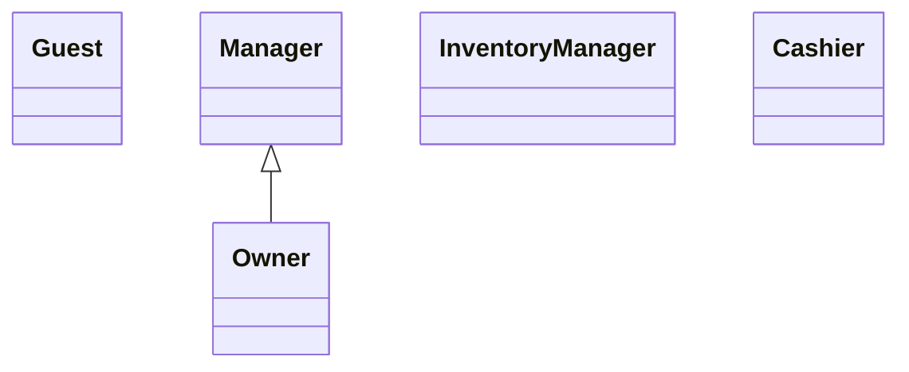

# SME Ops — Actors and Roles (Use Case Diagram Support)

**Project:** SME Ops (SME Optimizer)  
**Related documents:** [senarios.md](./senarios.md), [requirment.md](./requirment.md), [businessrule.md](./businessrule.md)  
**UML reference:** [`docs/uml/use-case-overview.puml`](../uml/use-case-overview.puml)

This document completes **OOSE Lab Task 4 — Identify actors from each scenario** for preparing use case diagrams.

---

## 1. Actor classification

| Type | Meaning in SME Ops |
|------|-------------------|
| **Primary** | Human roles that **initiate** main use cases inside the system |
| **Secondary** | Human roles with limited or oversight-only interaction (no separate secondary role in MVP) |
| **External** | People outside the login boundary but part of the business domain |
| **Supporting** | External systems or **automated** platform behaviour |

---

## 2. Primary actors

### A1 — Guest

| Attribute | Detail |
|-----------|--------|
| **Actor ID** | A1 |
| **Type** | Primary |
| **Description** | Unauthenticated visitor using public pages |
| **Goals** | Create a new shop (organization + owner account); sign in to an existing account |
| **Source scenarios** | S7 (informal onboarding), **V1** |
| **System identity** | No `User` profile; no JWT |
| **Routes** | `/`, `/register`, `/login` |

**Use cases initiated**

| ID | Use case |
|----|----------|
| UC-AUTH-1 | Register organization + owner account |
| UC-AUTH-2 | Login |

---

### A2 — Owner

| Attribute | Detail |
|-----------|--------|
| **Actor ID** | A2 |
| **Type** | Primary |
| **Role code** | `UserRole.OWNER` |
| **UI label** | Organization owner |
| **Description** | Organization owner with full business authority and **team management** |
| **Goals** | Run the shop, view profit, manage staff, manage inventory and expenses, use AI |
| **Source scenarios** | S6, S7, S8 → **V1, V5, V6, V7, V8** |
| **Default route after login** | `/dashboard` |

**UML generalization:** Owner **inherits** Manager (`Owner <|-- Manager` in PlantUML).

**Use cases initiated**

| Package | Use cases |
|---------|-----------|
| Authentication | UC-AUTH-2 Login, UC-AUTH-3 Refresh token, UC-AUTH-4 View profile |
| Dashboard & analytics | UC-DASH-1 KPI summary, UC-DASH-2 Revenue trend, UC-DASH-3 Top products, UC-DASH-4 Gross & net profit |
| Point of sale & sales | UC-POS-1 Record sale, UC-POS-2 Discount & payment, UC-POS-3 Decrement stock, UC-POS-4 Validate stock, UC-SALES-1 List sales, UC-SALES-2 Sale detail |
| Inventory | UC-INV-1 Manage products, UC-INV-2 Manage categories, UC-INV-3 Archive product, UC-INV-4 Low-stock alerts |
| Customers | UC-CUST-1 Create/update customer, UC-CUST-2 Delete customer, UC-CUST-3 Link customer to sale |
| Operating expenses | UC-EXP-1 Manage expense categories, UC-EXP-2 Record expense, UC-EXP-3 Edit/delete expense, UC-EXP-4 Filter register |
| Team management | UC-TEAM-1 List employees, UC-TEAM-2 Invite employee, UC-TEAM-3 Change employee role |
| AI assistant | UC-AI-1 View insights, UC-AI-2 Chat, UC-AI-3 Manage conversations |

**Routes:** `/dashboard`, `/assistant`, `/pos`, `/inventory`, `/customers`, `/sales`, `/expenses`, `/team`

---

### A3 — Manager (Shop Manager)

| Attribute | Detail |
|-----------|--------|
| **Actor ID** | A3 |
| **Type** | Primary |
| **Role code** | `UserRole.MANAGER` |
| **UI label** | Shop manager |
| **Description** | Day-to-day operations **without** team administration |
| **Goals** | Sell at POS, manage customers and expenses, review dashboard and insights |
| **Source scenarios** | S2, S3, S5, S6, S8 → **V3, V4, V6, V7** |
| **Default route after login** | `/dashboard` |

**Difference from Owner:** Cannot use team use cases (UC-TEAM-1, UC-TEAM-2, UC-TEAM-3).

**Use cases initiated**

Same as Owner **except** team management (no UC-TEAM-*).

**Routes:** `/dashboard`, `/assistant`, `/pos`, `/inventory`, `/customers`, `/sales`, `/expenses`

---

### A4 — Inventory Manager

| Attribute | Detail |
|-----------|--------|
| **Actor ID** | A4 |
| **Type** | Primary |
| **Role code** | `UserRole.INVENTORY_MANAGER` |
| **UI label** | Inventory manager |
| **Description** | Maintains product catalog and stock; no counter or finance screens |
| **Goals** | Add and update products and categories; keep stock levels accurate |
| **Source scenarios** | S1, S4 → **V2** |
| **Default route after login** | `/inventory` |

**Use cases initiated**

| Allowed | Not allowed |
|---------|-------------|
| UC-AUTH-2, UC-AUTH-3, UC-AUTH-4 | Dashboard, AI assistant |
| UC-INV-1, UC-INV-2, UC-INV-3, UC-INV-4 | POS, sales history |
| Product read via API (catalog for POS) | Customers, expenses, team |

**Routes:** `/inventory` only (primary UI)

---

### A5 — Cashier

| Attribute | Detail |
|-----------|--------|
| **Actor ID** | A5 |
| **Type** | Primary |
| **Role code** | `UserRole.CASHIER` |
| **UI label** | Cashier |
| **Description** | Front-counter staff for checkout and customer-facing sales |
| **Goals** | Fast checkout; optional customer link; view sales history |
| **Source scenarios** | S2, S3, S5 → **V3, V4** |
| **Default route after login** | `/pos` |

**Use cases initiated**

| Allowed | Not allowed |
|---------|-------------|
| UC-AUTH-2, UC-AUTH-3, UC-AUTH-4 | Dashboard, AI, inventory UI, expenses, team |
| UC-POS-1..4, UC-SALES-1, UC-SALES-2 | UC-CUST-2 Delete customer |
| UC-CUST-1, UC-CUST-3 | Product/category write |
| Product read (POS catalog) | |

**Routes:** `/pos`, `/customers`, `/sales`

---

## 3. External actor

### A6 — Customer (shop client)

| Attribute | Detail |
|-----------|--------|
| **Actor ID** | A6 |
| **Type** | External |
| **Description** | Person who buys at the shop; **does not log in** to SME Ops in the current MVP |
| **Goals** | Purchase goods; optionally be recognized for spend history |
| **Source scenarios** | S3 → **V3, V4** |
| **Interaction** | Indirect — staff links `Customer` record at POS |

**Use case diagram note**

- Customer is a **domain beneficiary**, not a system user.
- Prefer modeling **UC-CUST-3 Link customer to sale** under Cashier/Manager/Owner.
- Draw Customer as an external actor only if your course requires buyers on the diagram.

---

## 4. Supporting actors

### A7 — Supabase Auth

| Attribute | Detail |
|-----------|--------|
| **Actor ID** | A7 |
| **Type** | Supporting |
| **Description** | External identity provider for register, login, JWT, and invited user creation |
| **Linked use cases** | UC-AUTH-1, UC-AUTH-2, UC-TEAM-2 |
| **Source scenarios** | **V1**, **V5** |

---

### A8 — SME Ops System (automated)

| Attribute | Detail |
|-----------|--------|
| **Actor ID** | A8 |
| **Type** | Supporting |
| **Description** | Automated platform processes without a human click |
| **Examples** | Auto-seed expense categories (UC-EXP-5); stock decrement on sale; rule-based insights; unique slug generation |
| **Source scenarios** | **V2**, **V3**, **V6**, **V7** |

---

### A9 — OpenRouter (LLM provider)

| Attribute | Detail |
|-----------|--------|
| **Actor ID** | A9 |
| **Type** | Supporting |
| **Description** | Optional external API for AI chat when owner/manager configures an API key |
| **Linked use cases** | UC-AI-2 Chat with assistant |
| **Source scenarios** | **V8** |

---

## 5. Actor generalization (UML)

```text
Manager <|-- Owner
```

- **Owner** inherits all **Manager** operational use cases.
- **Inventory Manager** and **Cashier** are separate roles (no inheritance between them).



---

## 6. Role summary (one line each)

| Role | Purpose |
|------|---------|
| **Guest** | Registers a new business or logs in |
| **Owner** | Full control plus employee management |
| **Manager** | Daily operations and finance view; no team admin |
| **Inventory Manager** | Catalog and stock maintenance |
| **Cashier** | POS checkout and customers at the counter |

---

## 7. Actor × scenario traceability

| Actor | AS-IS scenarios | Visionary scenarios |
|-------|-----------------|---------------------|
| Guest | S7 | V1 |
| Owner | S6, S7, S8 | V1, V5, V6, V7, V8 |
| Manager | S2, S5, S6, S8 | V3, V6, V7 |
| Inventory Manager | S1, S4 | V2 |
| Cashier | S2, S3, S5 | V3, V4 |
| Customer (external) | S3 | V3, V4 |
| Supabase Auth | — | V1, V5 |
| System (automated) | — | V2, V3, V6, V7 |
| OpenRouter | — | V8 |

---

## 8. Actor × use case matrix

| Use case ID | Use case name | Guest | Owner | Manager | Inv. Mgr | Cashier |
|-------------|---------------|:-----:|:-----:|:-------:|:--------:|:-------:|
| UC-AUTH-1 | Register org + owner | ✓ | | | | |
| UC-AUTH-2 | Login | ✓ | ✓ | ✓ | ✓ | ✓ |
| UC-AUTH-3 | Refresh token | | ✓ | ✓ | ✓ | ✓ |
| UC-AUTH-4 | View profile | | ✓ | ✓ | ✓ | ✓ |
| UC-DASH-1 | View KPI summary | | ✓ | ✓ | | |
| UC-DASH-2 | View revenue trend | | ✓ | ✓ | | |
| UC-DASH-3 | View top products | | ✓ | ✓ | | |
| UC-DASH-4 | View gross & net profit | | ✓ | ✓ | | |
| UC-POS-1 | Record sale (checkout) | | ✓ | ✓ | | ✓ |
| UC-POS-2 | Apply discount & payment | | ✓ | ✓ | | ✓ |
| UC-POS-3 | Decrement stock | | ✓ | ✓ | | ✓ |
| UC-POS-4 | Validate stock | | ✓ | ✓ | | ✓ |
| UC-SALES-1 | List sales history | | ✓ | ✓ | | ✓ |
| UC-SALES-2 | View sale detail | | ✓ | ✓ | | ✓ |
| UC-INV-1 | Manage products | | ✓ | ✓ | ✓ | |
| UC-INV-2 | Manage categories | | ✓ | ✓ | ✓ | |
| UC-INV-3 | Archive product | | ✓ | ✓ | ✓ | |
| UC-INV-4 | Low-stock alerts | | ✓ | ✓ | ✓ | |
| UC-CUST-1 | Create/update customer | | ✓ | ✓ | | ✓ |
| UC-CUST-2 | Delete customer | | ✓ | ✓ | | |
| UC-CUST-3 | Link customer to sale | | ✓ | ✓ | | ✓ |
| UC-EXP-1 | Manage expense categories | | ✓ | ✓ | | |
| UC-EXP-2 | Record operating expense | | ✓ | ✓ | | |
| UC-EXP-3 | Edit/delete expense | | ✓ | ✓ | | |
| UC-EXP-4 | Filter expense register | | ✓ | ✓ | | |
| UC-TEAM-1 | List employees | | ✓ | | | |
| UC-TEAM-2 | Invite employee | | ✓ | | | |
| UC-TEAM-3 | Change employee role | | ✓ | | | |
| UC-AI-1 | View AI insights | | ✓ | ✓ | | |
| UC-AI-2 | Chat with assistant | | ✓ | ✓ | | |
| UC-AI-3 | Manage conversations | | ✓ | ✓ | | |

---

## 9. Role × feature matrix (UI / API)

| Feature | Owner | Manager | Inventory Mgr | Cashier |
|---------|:-----:|:-------:|:-------------:|:-------:|
| Dashboard & net profit | ✓ | ✓ | — | — |
| AI insights & assistant | ✓ | ✓ | — | — |
| POS checkout | ✓ | ✓ | — | ✓ |
| Sales history | ✓ | ✓ | — | ✓ |
| Inventory UI (write) | ✓ | ✓ | ✓ | — |
| Product read (POS API) | ✓ | ✓ | ✓ | ✓ |
| Customers (create/update) | ✓ | ✓ | — | ✓ |
| Delete customer | ✓ | ✓ | — | — |
| Operating expenses | ✓ | ✓ | — | — |
| Team management | ✓ | — | — | — |

**Implementation:** `apps/api/src/auth/permissions.ts`, `apps/web/src/lib/roles.ts`

---

## 10. What to draw on the use case diagram

**Inside the system boundary (required):**

1. Guest  
2. Owner  
3. Manager  
4. Inventory Manager  
5. Cashier  

**Outside boundary (optional):**

6. Customer (external)  
7. Supabase Auth (supporting)  
8. OpenRouter (supporting — AI sub-diagram)  

**Do not model as actors:**

- Organization (tenant context)  
- Product, Sale, Expense (domain entities)  
- Abel Mini Market (case-study name only)  

---

## 11. Per-actor diagram files

| Actor | PlantUML file |
|-------|----------------|
| Owner | [`docs/uml/diagrams/owner.puml`](../uml/diagrams/owner.puml) |
| Manager | [`docs/uml/diagrams/manager.puml`](../uml/diagrams/manager.puml) |
| Inventory Manager | [`docs/uml/diagrams/inventory-manager.puml`](../uml/diagrams/inventory-manager.puml) |
| Cashier | [`docs/uml/diagrams/cashier.puml`](../uml/diagrams/cashier.puml) |
| Overview (all actors) | [`docs/uml/use-case-overview.puml`](../uml/use-case-overview.puml) |

---

## Document status

| Item | File | Status |
|------|------|--------|
| Scenarios | `senarios.md` | Complete |
| Requirements | `requirment.md` | Complete |
| Business rules | `businessrule.md` | Complete |
| Actors & roles | `actors.md` | Complete |
| Use cases (from scenarios) | `usecases.md` | Complete |

---

*Prepared for OOSE Lab Task 4 and use case diagram authoring.*
